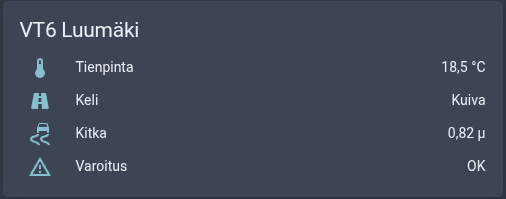
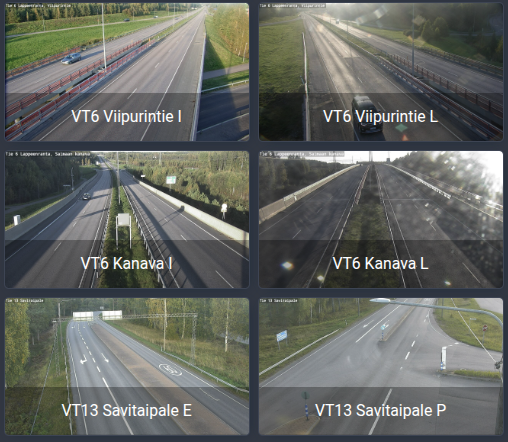

# Digitraffic Live for Home Assistant

Home Assistant integration that turns Fintraffic's live ships, trains and road traffic data into map feeds.

[![GitHub Release][releases-shield]][releases]
[![License][license-shield]](LICENSE)
[![GitHub Activity][commits-shield]][commits]

## Support

Hey dude! Help me out for a couple of :beers: or a :coffee:!

[](https://www.buymeacoffee.com/jesmak)

## What is it?

A custom component that turns live ships, trains and road traffic data from
[Fintraffic's Digitraffic](https://www.digitraffic.fi/) open data into **map feeds**: one sensor per feed, holding
everything in it as GeoJSON.

Show the feeds on a map with [ha-map-card](https://github.com/nathan-gs/ha-map-card) and the
[map feed plugin](https://github.com/jesmak/ha-map-card-plugin-map-feed), which draws heading arrows, colours
by ship type or train delay, and popups with details. The feed format is documented in
[map-feed-format.md](https://github.com/jesmak/ha-map-card-plugin-map-feed/blob/main/docs/map-feed-format.md),
so other integrations and template entities can produce feeds for the same card.

- **Ship feeds:** AIS positions inside an area, with names, types, destinations and draughts from the vessel
  register. Icebreakers can be highlighted.
- **Train feeds:** GPS positions of running trains on a route or inside an area, with delays, the last station
  passed, the next stop with track, passenger notices, and the composition when a popup is opened.
- **Traffic message feeds:** road works, traffic announcements and accidents, weight restrictions and exempted
  transports, with the stretch of road they cover, their times, working hours and restrictions.
- **Road maintenance feeds:** snow ploughs, gritters and other maintenance vehicles on state roads, and optionally
  where they have worked in the last hours.
- **Road condition feeds:** Fintraffic's driving conditions for sections of the main roads, now or up to 12 hours
  ahead.
- **Road weather station feeds:** road and air temperature, road surface, grip, wind and precipitation.
- **Weather camera feeds:** the latest picture from each view of Fintraffic's road cameras.
- **Road weather stations and weather cameras** as devices of their own: sensors for road and air temperature, road
  surface, grip and road weather warnings, and an image entity for each camera view.

## Installation

### With HACS

1. Add this repository to HACS custom repositories with type **Integration**
2. Search for Digitraffic Live in HACS and download it
3. Restart Home Assistant
4. Add the integration in Settings › Devices & services, then add feeds from its page

### Manual

1. Download the source code from the latest release
2. Copy the `custom_components/digitraffic_live` folder to your Home Assistant installation's
   `config/custom_components` folder
3. Restart Home Assistant
4. Add the integration in Settings › Devices & services, then add feeds from its page

## Settings

### Integration

| Name     | Type | Description                                                  | Default                   |
| -------- | ---- | ------------------------------------------------------------ | ------------------------- |
| language | enum | Language of the texts written into feeds: `fi`, `sv` or `en` | Home Assistant's language |

### Ship feed

Add with **Add ship feed** on the integration page. Every feed creates one sensor named after the feed.

| Name                  | Type    | Description                                                                      | Default     |
| --------------------- | ------- | -------------------------------------------------------------------------------- | ----------- |
| Name                  | string  | Name of the feed and its sensor                                                  |             |
| Area                  | circle  | Centre and radius, picked on a map                                               | home, 15 km |
| Ship types            | list    | `cargo`, `tanker`, `passenger`, `pilot`, `tug`, `fishing`, `pleasure`, `other`   | all         |
| Include moored        | boolean | Include moored and anchored ships                                                | on          |
| Highlight icebreakers | boolean | Uses winter navigation data. Icebreakers are shown whatever the type filters say | off         |
| Maximum position age  | minutes | Ships whose latest position is older are left out                                | 30          |
| Update interval       | seconds | How often the feed is fetched, at least 30                                       | 60          |

### Train feed

Add with **Add train feed** on the integration page. Choose route stations, an area, or both.

| Name                 | Type    | Description                                                                         | Default     |
| -------------------- | ------- | ----------------------------------------------------------------------------------- | ----------- |
| Name                 | string  | Name of the feed and its sensor                                                     |             |
| Route stations       | list    | Only trains that stop at every chosen station, e.g. Helsinki and Lappeenranta       | none        |
| Train categories     | list    | Long-distance, commuter, cargo, locomotive, test drive, on-track machines, shunting | all         |
| Limit to an area     | boolean | Only trains inside the area                                                         | off         |
| Area                 | circle  | Centre and radius, picked on a map                                                  | home, 30 km |
| Maximum position age | minutes | Trains whose latest position is older are left out                                  | 15          |
| Update interval      | seconds | How often the feed is fetched, at least 30                                          | 60          |

### Traffic message feed

Add with **Add traffic message feed**. Road works, announcements and restrictions whose road stretch or area touches
the feed's area are included.

| Name                       | Type    | Description                                                                          | Default     |
| -------------------------- | ------- | ------------------------------------------------------------------------------------ | ----------- |
| Name                       | string  | Name of the feed and its sensor                                                      |             |
| Area                       | circle  | Centre and radius, picked on a map                                                   | home, 30 km |
| Message types              | list    | Road works, traffic announcements, weight restrictions, exempted transports          | all         |
| Road works starting within | days    | Upcoming road works are included this many days ahead. `0` shows only those in force | 7           |
| Update interval            | seconds | How often the feed is fetched, at least 30                                           | 300         |

### Road maintenance feed

Add with **Add road maintenance feed**. Covers state roads maintained under Fintraffic's contracts; most city
streets are not included.

| Name                            | Type    | Description                                                        | Default     |
| ------------------------------- | ------- | ------------------------------------------------------------------ | ----------- |
| Name                            | string  | Name of the feed and its sensor                                    |             |
| Area                            | circle  | Centre and radius, picked on a map                                 | home, 30 km |
| Tasks                           | list    | Ploughing, salting, sanding, brushing and 43 other tasks           | all         |
| Maximum position age            | minutes | Vehicles whose latest position is older are left out               | 60          |
| Show where vehicles have worked | boolean | Draw the vehicles' routes as lines                                 | on          |
| Routes from the last            | hours   | How far back routes are drawn, at most 24                          | 2           |
| Update interval                 | seconds | How often the feed is fetched, at least 30                         | 60          |

### Road condition feed

Add with **Add road condition feed**. Road sections are drawn as lines coloured by driving conditions.

| Name                 | Type    | Description                                                | Default     |
| -------------------- | ------- | ---------------------------------------------------------- | ----------- |
| Name                 | string  | Name of the feed and its sensor                            |             |
| Area                 | circle  | Centre and radius, picked on a map                         | home, 50 km |
| Time                 | enum    | Now, or in 2, 4, 6 or 12 hours                             | now         |
| Only poor conditions | boolean | Leave out sections with normal driving conditions          | off         |
| Update interval      | seconds | How often the feed is fetched, at least 30                 | 600         |

### Road weather station and weather camera feeds

Add with **Add road weather station feed** or **Add weather camera feed**. Both have a name, an area (home, 30 km
by default) and an update interval (300 and 600 seconds). Station markers show the air temperature, or the road
temperature if you choose so with **Value on the map**; the popup has both. Markers turn amber or red when the station
warns about frost, snow or ice.

### Road weather station

Add with **Add road weather station** to get sensors for one station anywhere in Finland, for example to show on a
dashboard. The station becomes a device named after it, with these sensors:

| Sensor               | Description                                                                          |
| -------------------- | ------------------------------------------------------------------------------------ |
| Road temperature     | °C                                                                                   |
| Air temperature      | °C                                                                                   |
| Road surface         | Dry, moist, wet, wet and salty, frost, snow, ice, probably moist and salty or slushy |
| Grip                 | Friction coefficient µ, 0–1                                                          |
| Road weather warning | OK, beware, alarm, frost or rain                                                     |

Stations have up to four road sensors and two optical sensors, and many lack the first of them. Each value comes from
the first sensor that has one, road sensors before optical ones. A value that the station doesn't measure at all stays
unknown. Values are fetched every 300 seconds; change the interval with **Change road weather station**.

### Weather camera

Add with **Add weather camera** to get the pictures of one camera anywhere in Finland. The camera becomes a device with
an image entity for each of its views, named after the direction it looks, such as *Imatralle*. Cameras take a new
picture about every ten minutes, and the image entity updates when they do. New pictures are checked for every 600
seconds; change the interval with **Change weather camera**.

## Sensors

Every feed has one sensor, whose state is the number of items in the feed: ships, trains, traffic messages,
maintenance vehicles, weather stations or cameras. For road condition feeds it is the number of road sections with
poor or extremely poor conditions, which is handy in automations. The attributes follow the
[Map Feed format](https://github.com/jesmak/ha-map-card-plugin-map-feed/blob/main/docs/map-feed-format.md):

| Name               | Description                                        |
| ------------------ | -------------------------------------------------- |
| `map_feed_version` | Always `1`                                         |
| `geojson`          | The feed's items as a GeoJSON FeatureCollection    |
| `area`             | The feed's area, if it has one                     |
| `updated`          | When the feed was last fetched                     |
| `attribution`      | Data credit                                        |

None of the attributes are stored in the recorder, only the count. A feed that can't be fetched becomes
unavailable until the next successful update.

## Dashboard cards

Maps are drawn by the [map feed plugin](https://github.com/jesmak/ha-map-card-plugin-map-feed), whose README has
examples for every feed type. Station sensors and camera images work with Home Assistant's own cards. The examples
below come from a dashboard in Finnish. Entity IDs are made from the station or camera name and Home Assistant's
language, so check yours on the device's page.

### A road weather station



```yaml
type: entities
title: VT6 Luumäki
entities:
  - entity: sensor.tie_6_luumaki_kirkko_tien_lampotila
    name: Tienpinta
  - entity: sensor.tie_6_luumaki_kirkko_tienpinta
    name: Keli
  - entity: sensor.tie_6_luumaki_kirkko_pito
    name: Kitka
  - entity: sensor.tie_6_luumaki_kirkko_tiesaavaroitus
    name: Varoitus
```

### Weather cameras



Each picture is a `picture-entity` card. This is the YAML of a section in a sections view, where `columns: 6` puts
two cards side by side:

```yaml
type: grid
cards:
  - type: picture-entity
    entity: image.tie_6_lappeenranta_viipurintie_imatralle
    name: VT6 Viipurintie I
    show_state: false
    fit_mode: cover
    grid_options:
      columns: 6
  - type: picture-entity
    entity: image.tie_6_lappeenranta_viipurintie_kouvolaan
    name: VT6 Viipurintie L
    show_state: false
    fit_mode: cover
    grid_options:
      columns: 6
  # ...and the same for image.tie_6_lappeenranta_saimaan_kanava_imatralle,
  # image.tie_6_lappeenranta_saimaan_kanava_lappeenrantaan,
  # image.tie_13_savitaipale_lappeenrantaan and image.tie_13_savitaipale_mikkeliin
```

## Actions

### `digitraffic_live.get_train_composition`

Returns a train's cars and services as popup rows. The map feed plugin calls it when a train's popup is opened.

| Field            | Description                               |
| ---------------- | ----------------------------------------- |
| `departure_date` | The date the train left its first station |
| `train_number`   | For example `8` for IC 8                  |

## Data

Traffic data: [Fintraffic / digitraffic.fi](https://www.digitraffic.fi/), licensed under
[CC BY 4.0](https://creativecommons.org/licenses/by/4.0/).

Requests carry a `Digitraffic-User` header with the integration's name and version, as Digitraffic asks. It
contains no personal information. AIS only shows vessels that transmit it, which leaves out most small leisure
boats.

Keep areas to what a map shows at once, a radius of a few tens of kilometres. A 200 km traffic message or maintenance
feed is several hundred kilobytes, which Home Assistant sends to every open dashboard on each update. Weather station
and camera feeds look up each station's details once a day, one request per station.

Traffic messages are published in Finnish only. Their labels and the restriction and work types are written in the
integration's language. Road geometries are simplified to keep the feeds small.

## Development

Requires Python 3.14.

```
python3.14 -m venv .venv
.venv/bin/pip install -r requirements_test.txt
.venv/bin/pytest
.venv/bin/ruff check .
```

| Path                                | What it contains                                      |
| ----------------------------------- | ----------------------------------------------------- |
| `__init__.py`                       | Setup: one coordinator per feed                       |
| `config_flow.py`                    | The integration, feed, station and camera forms       |
| `coordinator.py`                    | Fetching feeds, and data shared between feeds         |
| `sensor.py`                         | The feed sensors and road weather station sensors     |
| `image.py`                          | Weather camera image entities                         |
| `ships.py`, `trains.py`             | Interpreting Digitraffic data and building feed items |
| `traffic_messages.py`, `maintenance.py`, `road_conditions.py`, `weather_stations.py`, `weather_cameras.py` | The same for road data |
| `geo.py`                            | Areas, geometry tests and line simplification         |
| `cache.py`                          | Caching station details                               |
| `feed.py`                           | Map Feed format building blocks                       |
| `api.py`                            | Digitraffic HTTP client                               |
| `services.py`                       | The composition action                                |
| `texts.py`, `texts/<language>.json` | Texts written into feeds                              |
| `translations/<language>.json`      | Home Assistant UI texts                               |

To add a language, copy `texts/en.json` and `translations/en.json` to `<code>.json`, translate the values, and
add the code to `LANGUAGES` in `const.py`. The tests check that every language has the same keys and
placeholders as English.

[commits-shield]: https://img.shields.io/github/commit-activity/y/jesmak/digitraffic_live.svg?style=for-the-badge
[commits]: https://github.com/jesmak/digitraffic_live/commits/main
[license-shield]: https://img.shields.io/github/license/jesmak/digitraffic_live.svg?style=for-the-badge
[releases-shield]: https://img.shields.io/github/release/jesmak/digitraffic_live.svg?style=for-the-badge
[releases]: https://github.com/jesmak/digitraffic_live/releases
